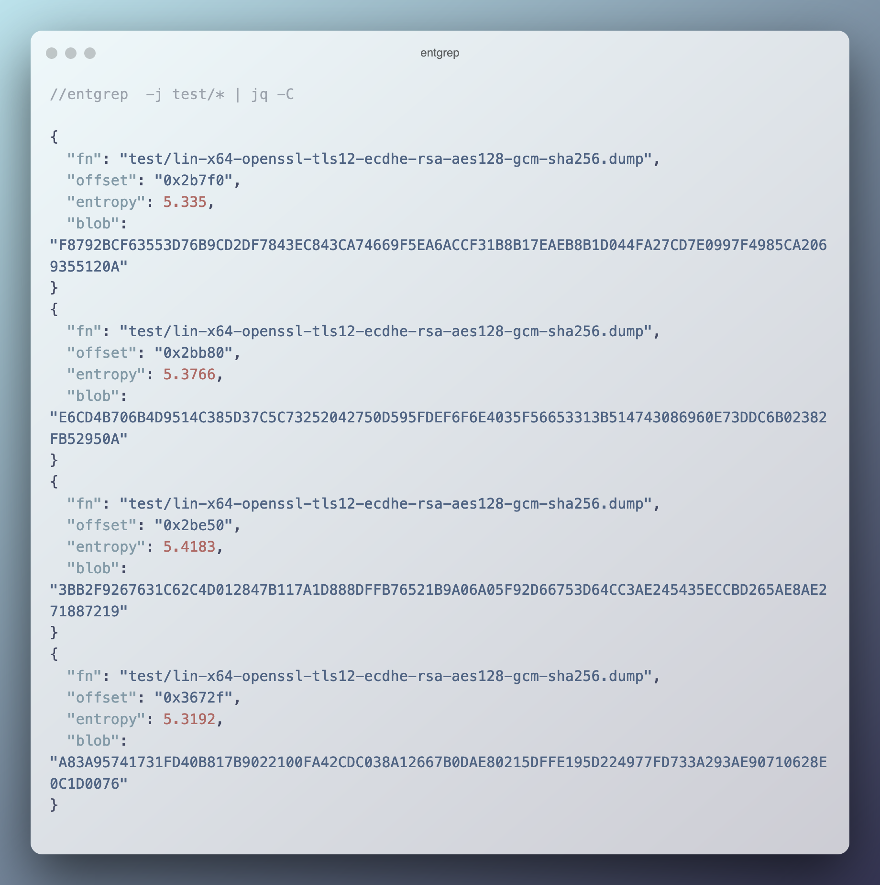

# entgrep
A Grep but for secrets (based on entropy)



## Installation

`nimble install entgrep`

## Usage

```
Usage:
  entgrep [optional-params] [files: string...]
A grep for secret stuff
Options:
  -h, --help                       print this cligen-erated help
  --help-syntax                    advanced: prepend,plurals,..
  -s=, --blobSize=   0..    48     set blobSize
  -t=, --threshold=  float  5.2    set threshold
  -j, --asJson       bool   false  set asJson
```

Find all 32 bytes long blobs with entropy over 5.5:

`entgrep -s 32 -t 5.5 path/to/file`